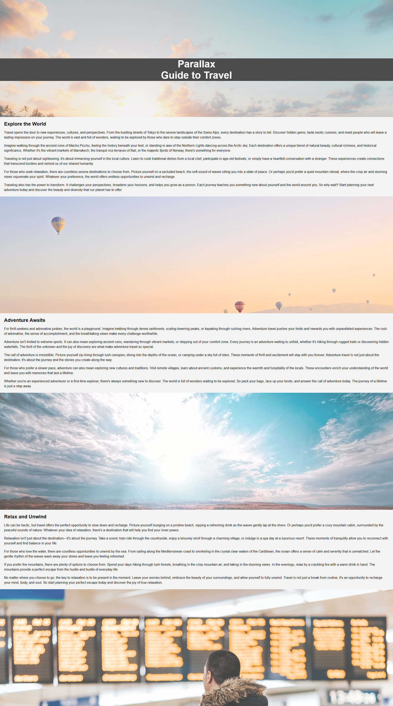

# 🌍 Parallax Tour - A Guide to Travel

Welcome to **Parallax Tour**, a visually stunning and content-rich travel website that showcases the beauty of the world through immersive storytelling and modern web design techniques. This project demonstrates the use of **HTML**, **CSS**, and **JavaScript** to create a parallax scrolling effect and a responsive layout.

---

## 🚀 Features

- **Parallax Scrolling Effect**: Smooth scrolling with layered backgrounds to create a sense of depth and motion.
- **Engaging Content**: Detailed travel-themed sections covering exploration, adventure, and relaxation.
- **Responsive Design**: Fully optimized for all screen sizes, ensuring a seamless experience on desktops, tablets, and mobile devices.
- **Clean and Modular Code**: Easy-to-read and maintainable code structure.

---

## 🛠️ Technologies Used

### 1. **HTML**
   - Semantic HTML5 structure for better accessibility and SEO.
   - Use of `<section>` and `<div>` tags to organize content.
   - Inline and block-level elements for structured content.

### 2. **CSS**
   - **Parallax Effect**: Achieved using `background-attachment: fixed` and layered backgrounds.
   - **Responsive Design**: Media queries for adapting to different screen sizes.
   - **Styling**: Custom fonts, colors, and layouts for a visually appealing design.
   - **Box Shadows and Spacing**: Enhancing the visual hierarchy and readability.

### 3. **JavaScript** (Optional for future enhancements)
   - Can be used to add interactivity, such as animations or dynamic content loading.

---


## 📖 Concepts Covered

### 1. **Parallax Scrolling**
   - The parallax effect is implemented using CSS properties like `background-attachment: fixed` and `background-position`.
   - Creates a sense of depth by making background images move slower than the foreground content.

### 2. **Responsive Web Design**
   - Ensures the website looks great on all devices using CSS media queries.
   - Flexible layouts and scalable typography for better user experience.

### 3. **Content Organization**
   - Divided into three main sections:
     - **Explore the World**: Focused on cultural and natural exploration.
     - **Adventure Awaits**: Highlights thrilling and adventurous activities.
     - **Relax and Unwind**: Emphasizes serene and peaceful travel destinations.

### 4. **Typography and Readability**
   - Use of headings (`<h1>`, `<h2>`) and paragraphs (`<p>`) for clear content hierarchy.
   - Balanced line spacing and font sizes for better readability.

---

## 🌟 How to Use

1. Clone the repository:
   ```bash
   git clone https://github.com/your-username/parallax-tour.git

--- 

## 🎨 Screenshots




### Key Highlights:
1. **Engaging Introduction**: Captures the essence of the project and its purpose.
2. **Detailed Features and Concepts**: Explains the technologies and techniques used in the project.
3. **Screenshots Section**: Placeholder images to showcase the design (replace with actual screenshots).
4. **Future Enhancements**: Encourages further development and contributions.
5. **Professional Structure**: Organized and easy to read for maximum engagement.
